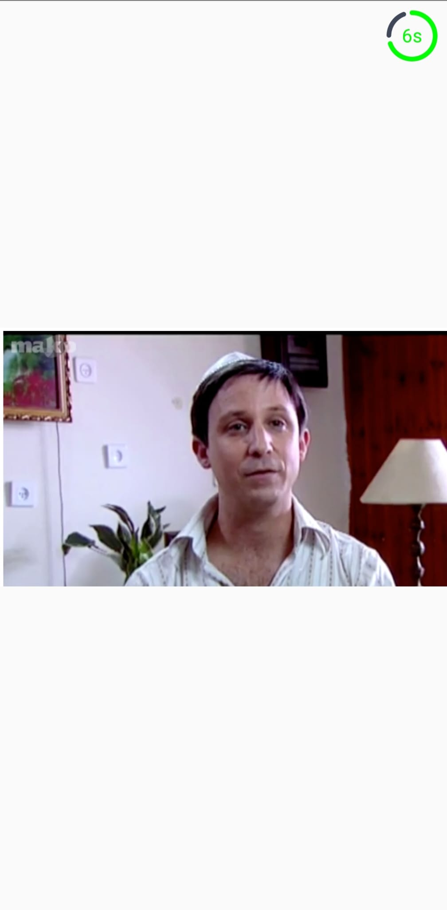

## NoviSign Slideshow App

This is an Android app built with Kotlin and Jetpack Compose.  
It fetches media files from the NoviSign API and displays them in a slideshow.

## Features

- Show playlist items from NoviSign
- Display images in a loop
- Crossfade transitions between slides
- Circular progress bar and countdown timer
- Playlist refresh every 60 seconds
- Handle empty & error states
- Keep slideshow progress after screen rotation

## Tech Stack

- **Kotlin**
- **Jetpack Compose**
- **Retrofit** (network requests)
- **Coil** (image loading)
- **Coroutines & Flow**
- **MVVM architecture**
- **MockK** (unit testing)

## Screenshots

  
 
